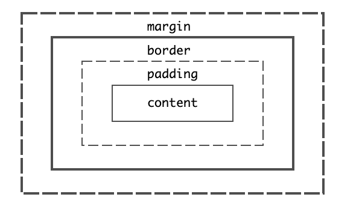

# CSS

## 选择器

### 基础选择器

> 标签、id、class、\*(通配符)

### 复合选择器

```css
/*(1)包含选择器：某元素内部指定的所有元素*/
.first p {
  color: red;
}
/*（2）并集选择器:一次选择多个元素*/
.first,
#nav {
  font-size: 16px;
}
/*（3）后代选择器：只选择指定元素下的儿子元素*/
ul > li {
  font-size: 20px;
}
```

### CSS 伪类和 CSS 伪元素

> 向某些选择器添加特殊效果

```css
a:link {
  color: black;
}
a:hover {
  color: red;
}

p:first-child {
  /*向元素的第一个子元素p[html中第一个p元素标签]*/
}

p:first-letter {
  /*向文本的第一个字母添加样式*/
}
p:first-line {
  /*向文本的首行添加特殊样式*/
}
p::before {
  /*在元素前添加内容*/
  content: url("logo.gif");
}
p::after {
  /*在元素后添加内容*/
}
```

### 结构伪类选择器

``` css
li:firstchild{
  color:white
}
li:lastchild{
  color:red;
}
li:nth-child(even){
  color:red
}
li:nth-last-child(even){
  color:red
}
li:nth-type-child(odd){
  color:red
}
li:nth-type-last-child(odd){
  color:red
}

```

## CSS 的元素显示模式

### 显示模式种类

> - 块级元素(block)：一行只能放置一个块级元素，可以设置宽高
> - 行内元素(inline)：一行可以放置多个行内元素，不可以直接设置宽高
> - 行内块元素(inline-block)：同行内元素特性，但是可以设置宽高；

### 显示模式转换

```css
a {
  display: block; /*将行内元素修改为块级元素，使得宽和高的设置生效，单独一行显示*/
  width: 300px;
  height: 100px;
}
/*将行级元素修改为行块级元素*/
a {
  display: inline-block; /*将行内元素修改为行块级元素，使得宽和高的设置生效*/
  width: 300px;
  height: 100px;
}
```

## CSS 的三大特性

### 层叠性

> 层叠是多个 CSS 规则发生冲突该如何解决；遵循以下三种规则：
>
> - 样式表的来源 （css 文件、style、内联样式）
> - 选择器的优先级（见 3.3-优先级）
> - 源码的出现顺序
>
> 层叠的注意事项：
>
> - 不建议使用 ID 选择器
> - 非必要情况下不要使用！important

```css
p {
  color: red;
}
/*如果出现重复定义会覆盖*/
p {
  color: blue; /*设置的颜色会覆盖red的设置*/
}
```

### 继承性

> 继承是沿着 DOM 树的节点向下的
>
> 和文本相关的属性能够被继承：color、font、font-family、font-size 等等

```html
<html>
  <head>
    <style>
      div {
        color: red;
      }
    </style>
  </head>
  <body>
    <div><p>p中的文本颜色会继承div中的设置</p></div>
  </body>
</html>
```

### 优先级

> 1. 继承或者通配符（\*）权重： 0，0，0，0
>
> 2. 元素选择器权重：0，0，0，1
>
> 3. 类选择器权重：0，0，1，0
>
> 4. id 选择器权重：0，1，0，0
>
> 5. 元素设置 style 权重：1，0，0，0
>
>    **权重高的 CSS 样式会覆盖权重低设置的样式** ；`color: red !important;`优先级高于内联样式

## CSS 中的单位

### 像素

```
px:CSS 中像素是逻辑像素并不等同于物理像素，尤其在高清（视网膜）屏幕下会根据硬件做适当缩放，通常 96px=1 英寸 = 2.54cm
dp pt : device independent pixels 设备无关像素
dpr: devicePixelRatio 设备像素缩放比

计算公式： 1px = （dpr）^2 * dp;
iphone5:
 设备像素：640dp * 1136dp
 逻辑像素：320px * 568px

DPI/PPI : 单位英寸内的像素密度
PPI越高，像素越高，图像越清晰
可视度越低，系统默认设置缩放比越大
           ldpi  mdpi  hdpi xhdpi
ppi        120    160  240   320
默认缩放比   0.75   1    1.5   2.0

设备分辨率：  1136*640dp ===》 √(1136^2 + 640^2) / 4 = 326ppi
326ppi属于retina屏幕，dpr=2
1px = dpr^2 * dp;
iphone5的屏幕为： 320 * 568 px；
```

### em 和 rem

> - em ： 当前元素的字号大小，元素内外边距、元素大小可以使用 em 做单位
> - rem: 根元素的字号大小，元素字体大小可以使用 rem 做单位
> - 根节点 html 有个伪类选择器（:root）

### 视口的相对单位

> - 视口： 浏览器窗口网页可见部分的边框区域，它不包括浏览器的地址栏、工具栏、状态栏
> - vh ： 视口高度的 1/100
> - vw: 视口宽度的 1/100
> - vmin： vh 和 vw 中最小的
> - vmax： vh 和 vw 中最大的\*

### CSS 自定义变量

```css
:root {
  font-size: 1em;
  --main-fontsize: 18px;
}
p {
  font-size: 1rem;
}
.title {
  /*使用自定义属性*/
  font-size: var(--main-fontsize);
}
```

## 盒模型



### 盒模型类型

> - 默认盒模型 `box-sizing:content-box` : 渲染元素的最终宽度 = width + border-left + border-right + padding-left + padding-right
> - `box-sizing: border-box`: 渲染元素的最终宽度为固定设置的 width 的宽度 (已包含：元素 width、border、padding)

### 普通文档流

> - 网页元素的默认布局行为，行内元素会随文字方向从左到右排列，到达容器边缘后会折行，块级元素会占一整行，前后有换行
> - 限定宽度和无限高度设计的,内容会填满视口的宽度，在必要的时候折行显示，因此容器的高度由内容决定

#### 控制溢出行为

> 明确设置容器高度后，显示不全内容就会溢出
>
> - 设置 overflow 的属性： hidden、visible、auto、scroll
> - overflow-x overflow-y 分别控制水平和垂直方向上的溢出

#### 实现等高列的方案

> - 容器盒子设置 display：table； 子项 设置 display：table-cell；但不建议使用
> - flex 布局 ： 弹性容器内的子元素默认是等高的

#### 实现垂直居中

> _vertical-align：只对行内块元素生效，块级元素会忽略这个属性设置_
>
> - 容器高度不固定时：给元素设置相等的上下内边距
> - flexbox 布局
> - 容器内文字只有一行：line-height = height
> - 容器和内容的高度都已知: 绝对定位设置垂直居中 : top：50%；margin-top : - height/2;
> - 容器高度已知，元素高度未知: 绝对定位设置垂直居中： top：50%；transform: translateY(-50%);

#### 实现 div 的垂直水平居中

```css
<style>
    .box {
      width: 100px;
      height: 100px;
      margin: auto;
      background-color: aqua;
    }
    .parent {
      display: flex;
      width: 400px;
      height: 400px;
      background-color: gray;
    }
  </style>

/*
  使用flex原因是上下空白空间被占用（猜测），如果不使用margin-top、margin-bottom设置为auto计算的值是0
  <div class="parent">
      <div class="box">123</div>
    </div>
*/
```

#### 外边距塌陷

> 相邻盒子的上下外边距相邻，最终的间距选择间距中最大的值；

##### 如何解决外边距塌陷

> - 对容器设置 overflow 为非 visible 的值
> - 设置元素为浮动、内联块、绝对定位或者固定定位
> - 使用 flexbox 布局

#### padding 的计算

> 当 padding 的值设为百分比时，其值是相对于父元素的 width 计算的

##### css 实现元素高度是父容器宽度的一半，子元素高度可以根据父容器的宽度发生等比例变化

> - 当父视图是 viewport（视口时），可以直接设置子元素的高度为：50vw
> - 当父元素固定宽高时，使用 flex 布局实现垂直水平居中，然后设置 padding: 25% 0 ; 同时设置 height：0 则可以实现
> - 使用 absolute 定位，将子元素的 left、right、top、bottom 均设置为 0；然后使用 margin 设置水平布局，设置 padding: 25% 0 ; 同时设置 height：0 实现高度为父元素的一半；

#### margin 的计算

> 当 margin 的值设为百分比时，其值是相对于父元素的 width 计算的

### CSS 常见问题

#### CSS3 硬件加速

> - CSS3 硬件加速也叫 GPU 加速，直接使用 GPU 渲染，减少 CPU 操作，不会触发重绘（repaint），因此能提升网页的性能；
> - 支持的 CSS 属性：transform、opacity、filter
> - 注意事项
>   - GPU 处理的内容过多会导致内存问题，尤其移动端的内存使用不当会导致崩溃
>   - GPU 渲染字体会导致抗锯齿无效，文本在动画期间会很模糊；

#### 分析几种 CSS 属性设置隐藏的特点

> - `display:none` : 元素不会出现在渲染树上，渲染时不占据任何的空间，不可以点击；修改属性导致元素重新显示会引发重排（重流），影响性能，而且隐藏的元素不会被读屏器读取；==会影响后代节点==
> - `visibility：hidden`: 会出现在视图树上，元素不显示，不可以点击，修改属性只会引发重绘，性能影响较少，读屏器能读取
> - `opacity：0` ： 元素会会出现在视图树上，元素不显示，但可以点击，修改元素属性影响最少；==会影响后代节点==

#### 如何覆盖(修改)CSS 中的!important

```html
在不修改代码(可添加)的前提下如何让图片的宽度修改为300px：


解法如下：


```

#### 如何解决 Retina 屏幕 1px 的问题

> 在 750 的设计稿设计了 1px 的边框，实际代码中要使用 1/2px,而 CSS 不支持小数只能显示 1px，导致边框变粗了；
>
> 可以使用 border:thin
>
> ==目前该问题已经基本不存在了，如果使用代码则可以使用伪元素+scale 缩放完成==

#### 如何实现骨架屏

> 待补充

#### Flex 布局中 flex 属性

> - flex-grow ： 如果容器剩有余空间，项目的放大比例，默认为 0，不放大
> - flex-shrink ：如果容器的剩余空间不足，项目的所有比例，默认为 1，空间不足时缩小
> - flex-basis： 定义了在分配多余空间之前，项目占据的主轴空间（main size），默认值为 auto, 即项目本身的大小

##### flex：1

> 容器有剩余空间时，忽略子项自身的 size，完全填充
>
> - flex-grow ：1
> - flex-shrink ：1
> - flex-basis：0%

##### flex：auto

> 容器有剩余空间时，先计算子项自身的 size，然后再平均分配
>
> - flex-grow ：1
> - flex-shrink ：1
> - flex-basis：auto

##### flex：none

> 计算子项自身的 size，填充容器
>
> - flex-grow ：0
> - flex-shrink ：0
> - flex-basis：auto

##### flex：initial

> - flex-grow ：0
> - flex-shrink ：1
> - flex-basis：auto

### CSS 规范

> - 命名规范
> - 属性设置顺序等

### CSS-Modules

> [CSS Modules 用法教程](https://www.ruanyifeng.com/blog/2016/06/css_modules.html)
>
> [深入浅出](https://segmentfault.com/a/1190000039846173)
>
> [CSS Modules](https://segmentfault.com/a/1190000019538288?utm_source=sf-similar-article)

####   使用 CSS Module 的项目修改 antd 的组件样式

> css module 针对全局的样式（使用`:global`包裹的），不会将类名进行 hash 化，因此可以将 antd 组件外部用来精细化控制样式的类定义在`:global`中，这样就避免了类名 hash 化，可以配合 antd 的类名规则，实现样式控制

```css
/*
 修改antd List组件的背景色
*/
:global(.adm-list-body-inner) {
  background-color: #f1f1f1;
}
```

### PostCSS

> [post-css 是啥](https://www.zhihu.com/question/46312839)

### tailwindcss

> [tailwindcss](https://www.tailwindcss.cn/docs)

### sass

### less

### 参考资料

> - 《深入解析 CSS》
