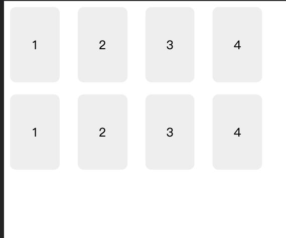

# 布局

## 浮动

### 浮动设计的初衷

> - 为了实现类似报纸中文字围绕图片排列的布局而产生的
> - 使元素脱离文档流，按照指定方向发生移动，遇到父级边界或者相邻的浮动元素停了下来。


### 浮动产生的问题

##### 浮动元素的高度不会被父容器采纳

> 在开发中经常需要给浮动的元素清理浮动带来的影响

```css
.clearfix::before,
.clearfix::after {
  /*
   清除浮动使用display：table能够包含外边距，利用了CSS的特性，创建一个display：table的元素。
   也就是在元素内隐式创建一个表格行和一个单元格，因为外边距无法通过单元格折叠
  */
  display: table;
  content: "";
}
.clearfix::after {
  clear: both; /*使得伪元素出现在浮动元素的底部*/
}
```

##### 浮动元素如果高度不一致还会导致布局错乱

> 4 个浮动的盒子，一行排列两个，如果高度不同，盒子编号为 3 的会出现在第一行高度最低的下面，这主要也是因为浮动的特性导致的：围绕浮动元素排列

```css
/*解决方法*/
.item:nth-child(odd) {
  clear: left; /*清除每行第一个元素的浮动即可*/
}
```

##### 两个元素设置 float:left 后，由于某一个元素的内容较多，会导致另外一个元素底部出现空白，也就是高度不一致问题

> - 多栏布局 ： 设置 column-count: N;
>   - 多栏布局不可以自由设置多栏的宽度
>   - 通常用于文章的布局，对于网页的常规元素布局不适合
> - 盒布局 ： display: -moz-box;display: -webkit-box;
>   - 可以自由设置多栏的宽度
> - flexbox 布局

#### 清除浮动的原理

##### BFC 概念

> BFC 是块级格式化上下文，是文档流中的一块独立部分，将内部元素的布局与外部相隔离，创建了 BFC 的元素具有以下特征：
>
> - 包含了内部元素的上下外边距，因此不会与 BFC 以外的元素上下边距重叠
> - BFC 包含内部的浮动元素-- 父容器高度采纳浮动元素的高度
> - 不会与 BFC 外边的浮动元素重叠

##### 如何创建 BFC

> - float : left 或者 right
> - overflow 设置为不为 visible
> - display 设置为：inline-block table-cell flex grid
> - position: absolute 或者 fixed

##### clear

> - 让元素自身不能与前面浮动的元素相邻（元素后面的浮动元素不影响）
> - 只有作用在块级盒子上才起作用，这也是为什么清除浮动时会给 after 伪元素设置 display:block 的原因

#### 网格系统

> 要构建一个网格系统，首先要定义它的行为。通常网格系统的每行被划分为特定数量的列，一般是 12 个，但也可以是其他数。每行子元素的宽度可能等于 1~12 个列的宽度。

##### 简易网格布局



```html
<html lang="en">
  <head>
    <style>
      .container {
        max-width: 1080px;
        margin: 0 auto;
        background-color: #fff;
      }
      /*网格系统:每列的布局*/
      [class*="column-"] {
        float: left;
        background-color: #fff;
      }
      /*列的宽度*/
      .column-1 {
        width: 8.3333%;
      }
      .column-2 {
        width: 16.6667%;
      }
      .column-3 {
        width: 25%;
      }
      .column-4 {
        width: 33.3333%;
      }
      .column-5 {
        width: 41.6667%;
      }
      .column-6 {
        width: 50%;
      }
      .column-7 {
        width: 58.3333%;
      }
      .column-8 {
        width: 66.6667%;
      }
      .column-9 {
        width: 75%;
      }
      .column-10 {
        width: 83.3333%;
      }
      .column-11 {
        width: 91.6667%;
      }
      .column-12 {
        width: 100%;
      }
      /*清除每行的浮动*/
      .row::after {
        display: block;
        content: "";
        clear: both;
      }
      /*列内元素*/
      .item {
        margin-right: 1.5em;
        margin-bottom: 1em;
        background-color: #eee;
        height: 100px;
        border-radius: 0.5em;
        text-align: center;
        line-height: 100px;
      }
    </style>
  </head>
  <body>
    <div class="container">
      <div class="row">
        <div class="column-3"><div class="item">1</div></div>
        <div class="column-3"><div class="item">2</div></div>
        <div class="column-3"><div class="item">3</div></div>
        <div class="column-3"><div class="item">4</div></div>
      </div>
      <div class="row">
        <div class="column-3"><div class="item">1</div></div>
        <div class="column-3"><div class="item">2</div></div>
        <div class="column-3"><div class="item">3</div></div>
        <div class="column-3"><div class="item">4</div></div>
      </div>
    </div>
  </body>
</html>
```

#### 定位

##### relative （相对定位）

> 设置了相对定位之后，通过修改`top,left,bottom,right`值，元素会在自身文档流所在位置上被移动，其他的元素则不会调整位置来弥补它偏离后剩下的空隙。

##### absolute （绝对定位）

> 设置了绝对定位之后，元素脱离文档流，其他的元素会调整位置来弥补它偏离后剩下的空隙。元素偏移是相对于是它最近的设置了定位属性（`position`值不为 static）的元素。且如果元素为块级元素（`display`属性值为`block`)，那么它的宽度也会由内容撑开

##### fixed （固定定位）

> 设置了固定定位之后，元素相对的偏移的参考是可视窗口，即使页面滚动，元素仍然会在固定位置。

##### z-index(堆叠顺序)

> - 默认后来者居上，后面的盒子会压在前面的盒子上
> - 调整盒子的层级 ： z-index
> - 只能适用于相对定位、绝对定位；其他标准流无效

#### flexbox

##### 基础知识

> [Flex 布局教程：语法篇](https://www.ruanyifeng.com/blog/2015/07/flex-grammar.html)

##### 实战篇

> [Flex 实际布局篇](https://www.ruanyifeng.com/blog/2015/07/flex-examples.html)

##### 解决 space-evenly 的兼容性

> _假设容器内有 4 个元素_:
>
> - space-evenly ： 容器间隙由 5（N+1）个间隙平分
> - space-between ：首个元素放在起点，末尾元素放在终点 容器间隙由 3（N-1）个间隙平分
> - 解决兼容性： 可以给 flex 容器添加 before 和 after 伪类元素宽度为 0 ；这样间隙就会编程 （N-1+2）符合 space-evenly 的等间距拆分

##### flex

> - flex 属性的含义：占空白区域的份数
> - flex-grow: 该属性定义项目的放大比例；【有剩余空间时】
> - flex-shrink：该属性定义项目的缩小比例；【空间不足时】
> - flex-basis: 设置子元素宽度或者高度
> - flex-wrap: 设置是否换行

#### grid 网格布局

>

#### Bootstrap

> BootStrap 主要通过百分比宽度（max-width：50%，max-width：25%）、flex 属性及媒体查询，来实现栅格化布局的；

#### 响应式布局

##### 淘宝的 flexible 方案（移动端）

> 通过 js 脚本监听页面屏幕大小的变化，动态设置 html（根元素）font-size 的大小；根据设计稿的规范 documentElement.client/(3.75|7.5) ；结合 rem 可以完成响应式布局；

##### viewport

```html
<meta name="viewport" content="width=device-width, initial-scale=1" />
```

> - 可视视口：屏幕大小，不滚动可以看到的区域（可以类比：放大镜的尺寸）;通过设置 width 的值可以改变可视视口的大小；当 width=device-width x 2 ; 可视区域就会变大了；initial-scale：可以理解为放大镜倍率；
> - 布局视口：页面真实的大小；

##### 1px 问题

> 真正的原因是，一般多倍的设计图设计了 1px 的边框，在手机上缩小呈现时，由于 css 最低只支持显示 1px 大小，导致边框太粗的效果，实际是一种视觉差，并非 1px 真的变粗了

```css
.hairline {
  position: relative;
}
.hairline::after {
  content: "";
  position: absolute;
  top: 0;
  left: 0;
  height: 1px;
  width: 100%;
  transform: scaleY(0.5);
  transform-origin: 0 0;
  background-color: #ededed;
}
```

##### 图片自适应

```css
# 将图片设置为背景 并居中，然后设置 ： background-size: cover;
div.img {
    background: url("path/to/img") no-repeat center;
    background-size: cover;
}
```

##### 圣杯布局

```html
<html lang="en">
  <head>
    <style>
      .main,
      .left,
      .right {
        float: left;
        height: 200px;
      }

      .main {
        width: 100%;
        background-color: aqua;
      }

      .left {
        width: 100px;
        background-color: orange;
        margin-left: -100%;
        position: relative;
        left: -100px;
      }

      .right {
        width: 200px;
        background-color: red;
        margin-left: -200px;
        position: relative;
        right: -200px;
      }

      .container {
        padding-left: 100px;
        padding-right: 200px;
      }
    </style>
  </head>
  <body>
    <div class="container">
      <div class="main">2</div>
      <div class="left">1</div>
      <div class="right">3</div>
    </div>
  </body>
</html>
```

##### 双飞翼布局

```html
<html>
  <style>
    .column {
      text-align: center;
      height: 300px;
      line-height: 300px;
    }
    #left,
    #right,
    #center {
      float: left;
    }
    #center {
      width: 100%;
      background: rgb(206, 201, 201);
    }
    #left {
      width: 200px;
      margin-left: -100%;
      background: rgba(95, 179, 235, 0.972);
    }
    #right {
      width: 150px;
      margin-left: -150px;
      background: rgb(231, 105, 2);
    }
    .content {
      margin: 0 150px 0 200px;
    }
  </style>

  <body>
    <div id="header">#header</div>

    <div id="container">
      <div id="center" class="column">
        <div class="content">#center</div>
      </div>
      <div id="left" class="column">#left</div>
      <div id="right" class="column">#right</div>
    </div>

    <div id="footer">#footer</div>
  </body>
</html>
```

##### 九宫格布局

```html
<html lang="en">
  <head>
    <style>
      .container {
        display: flex;
        flex-wrap: wrap;
      }
      .item {
        width: 33.33%;
        background-color: pink;
        text-align: center;
      }
    </style>
  </head>
  <body>
    <div class="container">
      <div class="item">1</div>
      <div class="item">1</div>
      <div class="item">1</div>
      <div class="item">1</div>

      <div class="item">1</div>
      <div class="item">1</div>
      <div class="item">1</div>
      <div class="item">1</div>

      <div class="item">1</div>
    </div>
  </body>
</html>
```
